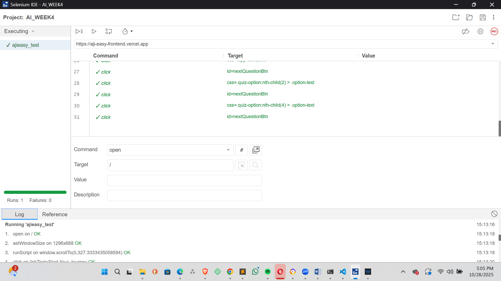

# Exploring AI in testing
This Readme.md file explores the different aspects of AI testing that i have done using selenium IDE.
i have carried the tests on my website ajieasy which has the url: https://aji-easy-frontend.vercel.app
I noticed that using AI in testing is actually fast as compared to human testing. For a human to handle the test he/she is going to take a long period of time in identifying the problems. AI does it all it tests, looks for errors and even makes it easier to rectify and debug.
Here is a screenshot of the IDE :
.png)

