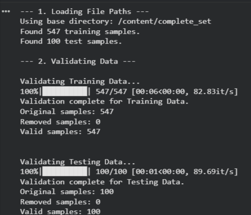
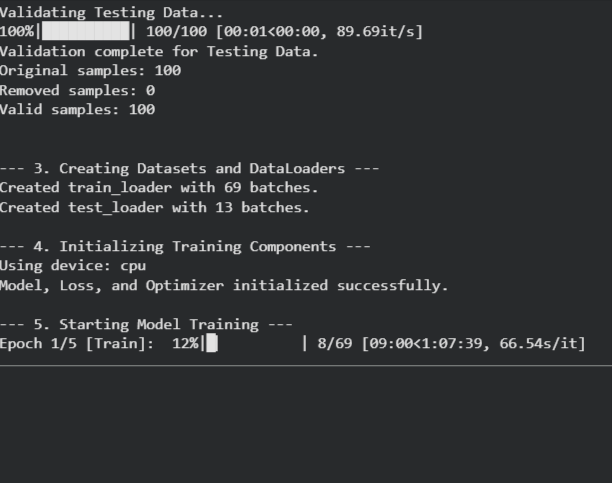

# U-Net for Breast Cancer Segmentation

This project implements a U-Net convolutional neural network architecture for semantic segmentation of breast cancer ultrasound images. The model is built with PyTorch and is designed to identify and segment tumor regions from surrounding tissue, classifying each pixel as either "tumor" (malignant/benign) or "background."

The script handles the entire pipeline: loading file paths, validating data, creating a custom `Dataset` and `DataLoader`, defining the U-Net model, and running a complete training and validation loop.

## Features

* **End-to-End Pipeline**: A single script to preprocess, train, and validate the model
* **Data Validation**: Includes a robust function to check for missing or corrupted images and masks before training begins
* **Custom PyTorch Dataset**: A custom `BreastCancerDataset` class to efficiently load and transform image-mask pairs
* **Classic U-Net Architecture**: Implements the standard U-Net model with an encoder-decoder path and skip connections
* **Flexible Training**: Uses `argparse` to easily configure training parameters like data path, epochs, and learning rate from the command line

## Model Architecture

The model is a classic U-Net, which follows an "encoder-decoder" architecture:

1. **Encoder (Down-sampling)**: The model uses a series of `DoubleConv` (Conv2d → BatchNorm → ReLU) blocks and `MaxPool2d` layers to down-sample the image. This compresses the image into a low-resolution, high-feature representation, learning what is in the image.

2. **Decoder (Up-sampling)**: The model uses `ConvTranspose2d` layers to up-sample the feature map back to the original image size.

3. **Skip Connections**: The "magic" of the U-Net is that it concatenates feature maps from the encoder path with the corresponding layer in the decoder path. This allows the model to combine high-level "what" information with low-level "where" information, resulting in very precise pixel-level segmentation.

## Project Screenshots

**Example of Training Data (Image and Mask):**



**Training Process (Loss Curve):**



## How to Use

### 1. Prerequisites

Make sure you have Python 3 and the following libraries installed. You can install them using pip:

```bash
pip install torch torchvision pandas pillow tqdm
```

### 2. Data

You must have the "Automatic Diagnosis of Breast Cancer" dataset. Unzip it so that you have the `complete_set` folder, which should contain `training_set` and `testing_set`.

### 3. Training the Model

This script is run from the command line and requires you to pass the path to your data. The most important argument is `--data_path`, which must point to the `complete_set` folder.

**Example Command:**

```bash
# On Colab/Linux
python app.py --data_path /content/complete_set

# On Windows
python app.py --data_path "C:\MyData\iuss-23-24-automatic-diagnosis-breast-cancer\complete_set"
```

**Command-Line Arguments:**

* `--data_path` (str, **Required**): Path to the 'complete_set' directory
* `--epochs` (int, Optional): Number of training epochs (Default: `5`)
* `--batch_size` (int, Optional): Batch size for training (Default: `8`)
* `--learning_rate` (float, Optional): Learning rate for the Adam optimizer (Default: `0.0001`)
* `--output_model` (str, Optional): Path to save the final trained model (Default: `unet_breast_cancer.pth`)

After training, the script will save the model weights to `unet_breast_cancer.pth` (or the name you provided).

## Project Structure

```
.
├── app.py                          # Main training script
├── unet_breast_cancer.pth          # Saved model weights (generated after training)
├── images/                         # Screenshots and documentation images
│   ├── training_data_example.png
│   ├── loss_curve.png
│   └── ...
├── complete_set/                   # Dataset directory
│   ├── training_set/
│   │   ├── images/
│   │   └── masks/
│   └── testing_set/
│       ├── images/
│       └── masks/
└── README.md                       # This file
```

## Results

*(Add your results here, such as:)*
* Training and validation loss curves
* Dice coefficient/IoU scores
* Sample predictions on test images
* Confusion matrix or other evaluation metrics

## Future Improvements

* Add data augmentation to improve model generalization
* Implement early stopping and learning rate scheduling
* Add model evaluation metrics (Dice score, IoU, F1-score)
* Create inference script for making predictions on new images
* Experiment with different loss functions (Dice loss, Focal loss)
* Try different U-Net variants (Attention U-Net, ResUNet)

## License

*(Specify your license here)*

## Acknowledgments

* Original U-Net paper: [U-Net: Convolutional Networks for Biomedical Image Segmentation](https://arxiv.org/abs/1505.04597)
* Dataset: Automatic Diagnosis of Breast Cancer

## Contact

githukadanson23@gmail.com
https://github.com/DanEinstein